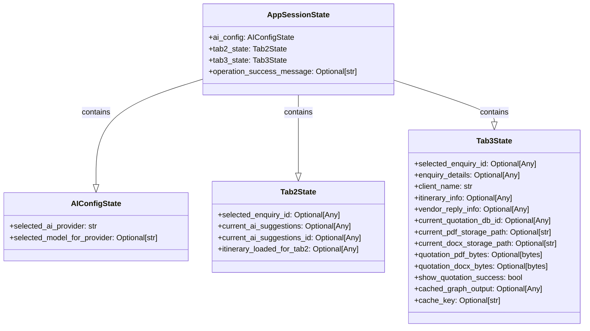

# Session State Refactoring Plan

## 1. Goal

Refactor the session state management in the Streamlit application by replacing direct `st.session_state` key access with a structured approach using Pydantic models. This aims to improve code organization, type safety, maintainability, and reduce the risk of typos in session state keys.

## 2. Pydantic Model Definitions

The following Pydantic models will be defined (likely in `app.py` or a dedicated `models.py` file) to structure the session state:

```python
from typing import Optional, Any, List, Dict # Ensure all necessary imports are present
from pydantic import BaseModel, Field
import streamlit as st

class AIConfigState(BaseModel):
    selected_ai_provider: str = "OpenRouter"
    selected_model_for_provider: Optional[str] = None

class Tab2State(BaseModel):
    selected_enquiry_id: Optional[Any] = None
    current_ai_suggestions: Optional[Any] = None
    current_ai_suggestions_id: Optional[Any] = None
    itinerary_loaded_for_tab2: Optional[Any] = None

class Tab3State(BaseModel):
    selected_enquiry_id: Optional[Any] = None # Was selected_enquiry_id_tab3
    enquiry_details: Optional[Any] = None
    client_name: str = "Valued Client"
    itinerary_info: Optional[Any] = None
    vendor_reply_info: Optional[Any] = None
    current_quotation_db_id: Optional[Any] = None
    current_pdf_storage_path: Optional[str] = None
    current_docx_storage_path: Optional[str] = None
    quotation_pdf_bytes: Optional[bytes] = None
    quotation_docx_bytes: Optional[bytes] = None
    show_quotation_success: bool = False # Was show_quotation_success_tab3
    cached_graph_output: Optional[Any] = None
    cache_key: Optional[str] = None

class AppSessionState(BaseModel):
    ai_config: AIConfigState = Field(default_factory=AIConfigState)
    tab2_state: Tab2State = Field(default_factory=Tab2State)
    tab3_state: Tab3State = Field(default_factory=Tab3State)
    operation_success_message: Optional[str] = None

    class Config:
        arbitrary_types_allowed = True
```

A single instance of `AppSessionState` will be stored in `st.session_state.app_state`.

### Mermaid Diagram of Models



## 3. Refactoring Steps per File

### 3.1. `app.py`

1.  **Add Pydantic Dependency**:
    *   Ensure `pydantic` is in `requirements.txt` (Confirmed: it is present).
2.  **Define Pydantic Models**:
    *   Add the `AIConfigState`, `Tab2State`, `Tab3State`, and `AppSessionState` class definitions near the top of the file, after imports.
3.  **Initialize New Session State Structure**:
    *   Replace the block of `if 'key' not in st.session_state:` checks (lines 20-67) with:
        ```python
        # --- Initialize session state ---
        if 'app_state' not in st.session_state:
            st.session_state.app_state = AppSessionState()
        ```

### 3.2. `src/utils/constants.py`

*   The following session key constants will become redundant and should be commented out or removed:
    *   `SESSION_KEY_SELECTED_AI_PROVIDER`
    *   `SESSION_KEY_SELECTED_MODEL_FOR_PROVIDER`
    *   `SESSION_KEY_TAB2_SELECTED_ENQUIRY_ID`
    *   `SESSION_KEY_TAB2_CURRENT_AI_SUGGESTIONS`
    *   `SESSION_KEY_TAB2_CURRENT_AI_SUGGESTIONS_ID`
    *   `SESSION_KEY_TAB2_ITINERARY_LOADED_FLAG`
    *   `SESSION_KEY_TAB3_SELECTED_ENQUIRY_ID`
    *   `SESSION_KEY_OPERATION_SUCCESS_MESSAGE`

### 3.3. `src/llm/llm_providers.py`

*   **Line 11**: `st.session_state.get('selected_model_for_provider')` becomes `st.session_state.app_state.ai_config.selected_model_for_provider`
*   **Line 16**: `st.session_state.get('selected_model_for_provider')` becomes `st.session_state.app_state.ai_config.selected_model_for_provider`

### 3.4. `src/ui/sidebar.py`

*   **Lines 34-37**: The initial `if 'key' not in st.session_state:` checks for `selected_ai_provider` and `selected_model_for_provider` can be removed, as defaults are handled by `AppSessionState`.
*   All direct reads/writes to `st.session_state.selected_ai_provider` become `st.session_state.app_state.ai_config.selected_ai_provider`.
*   All direct reads/writes to `st.session_state.selected_model_for_provider` become `st.session_state.app_state.ai_config.selected_model_for_provider`.
    *   Examples:
        *   L42: `st.session_state.selected_ai_provider` -> `st.session_state.app_state.ai_config.selected_ai_provider`
        *   L54: `st.session_state.selected_ai_provider` -> `st.session_state.app_state.ai_config.selected_ai_provider`
        *   L56: `st.session_state.selected_ai_provider = selected_provider` -> `st.session_state.app_state.ai_config.selected_ai_provider = selected_provider`
        *   And so on for all other occurrences.

### 3.5. `src/ui/components/tab3_ui_components.py`

*   Replace all `st.session_state.tab3_...` keys with `st.session_state.app_state.tab3_state....`.
    *   Example L7: `st.session_state.tab3_enquiry_details` -> `st.session_state.app_state.tab3_state.enquiry_details`
    *   Example L8: `st.session_state.tab3_client_name` -> `st.session_state.app_state.tab3_state.client_name`
    *   Example L22: `st.session_state.tab3_itinerary_info` -> `st.session_state.app_state.tab3_state.itinerary_info`
    *   Example L36: `st.session_state.tab3_vendor_reply_info` -> `st.session_state.app_state.tab3_state.vendor_reply_info`
    *   Example L81: `st.session_state.get('tab3_current_pdf_storage_path')` -> `st.session_state.app_state.tab3_state.current_pdf_storage_path` (and similar for `.get()`)
    *   Example L96: `st.session_state.get('tab3_quotation_pdf_bytes')` -> `st.session_state.app_state.tab3_state.quotation_pdf_bytes`
*   Replace `st.session_state.selected_ai_provider` (L55) with `st.session_state.app_state.ai_config.selected_ai_provider`.

### 3.6. `src/ui/components/tab3_actions.py`

*   Replace all `st.session_state.tab3_...` keys with `st.session_state.app_state.tab3_state....`.
    *   Example L23: `st.session_state.tab3_vendor_reply_info = ...` -> `st.session_state.app_state.tab3_state.vendor_reply_info = ...`
    *   Example L25: `st.session_state.tab3_cached_graph_output = None` -> `st.session_state.app_state.tab3_state.cached_graph_output = None`
    *   Example L29: `st.session_state.show_quotation_success_tab3 = False` -> `st.session_state.app_state.tab3_state.show_quotation_success = False`
*   Replace `st.session_state.operation_success_message` (L22, L80, etc.) with `st.session_state.app_state.operation_success_message`.
*   Replace `st.session_state.selected_ai_provider` (L185) with `st.session_state.app_state.ai_config.selected_ai_provider`.
*   Replace `st.session_state.get('selected_model_for_provider')` (used implicitly in `_generate_graph_cache_key` call if it's passed through) with `st.session_state.app_state.ai_config.selected_model_for_provider`.

### 3.7. `src/ui/tabs/tab1_new_enquiry.py`

*   Update all session state assignments (Lines 40-60) to use the new `app_state` structure:
    *   `st.session_state.selected_enquiry_id` (L40) -> `st.session_state.app_state.tab2_state.selected_enquiry_id`
    *   `st.session_state.current_ai_suggestions` (L41) -> `st.session_state.app_state.tab2_state.current_ai_suggestions`
    *   `st.session_state.current_ai_suggestions_id` (L42) -> `st.session_state.app_state.tab2_state.current_ai_suggestions_id`
    *   `st.session_state.itinerary_loaded_for_tab2` (L43) -> `st.session_state.app_state.tab2_state.itinerary_loaded_for_tab2`
    *   `st.session_state.selected_enquiry_id_tab3` (L45) -> `st.session_state.app_state.tab3_state.selected_enquiry_id`
    *   `st.session_state.tab3_enquiry_details` (L46) -> `st.session_state.app_state.tab3_state.enquiry_details`
    *   `st.session_state.tab3_client_name` (L47) -> `st.session_state.app_state.tab3_state.client_name`
    *   ...and so on for all `tab3_...` keys.
    *   `st.session_state.operation_success_message` (L56) -> `st.session_state.app_state.operation_success_message`

### 3.8. `src/ui/ui_helpers.py`

*   The function `create_enquiry_selection_ui(st_object, get_all_enquiries_func, session_state_key_for_selected_id, on_change_callback, no_enquiries_message)` is generic.
*   **Modification Strategy**:
    1.  Change the `session_state_key_for_selected_id` parameter. Instead of a string key, it will now expect two arguments:
        *   `state_model_instance`: The actual Pydantic model instance (e.g., `st.session_state.app_state.tab2_state` or `st.session_state.app_state.tab3_state`).
        *   `field_name_for_selected_id`: A string representing the attribute name on the model (e.g., `"selected_enquiry_id"`).
    2.  Update calls to this function in `tab2_manage_itinerary.py` and `tab3_vendor_quotation.py` accordingly.
    3.  Inside `create_enquiry_selection_ui`:
        *   Replace `st.session_state.get(session_state_key_for_selected_id)` with `getattr(state_model_instance, field_name_for_selected_id, None)`.
        *   Replace `st.session_state[session_state_key_for_selected_id] = None` with `setattr(state_model_instance, field_name_for_selected_id, None)`.
        *   Replace `st.session_state[session_state_key_for_selected_id] = selected_value` with `setattr(state_model_instance, field_name_for_selected_id, selected_value)`.

    *Specific lines to change in `ui_helpers.py` based on this strategy:*
    *   L36: `st.session_state.get(session_state_key_for_selected_id)` -> `getattr(state_model_instance, field_name_for_selected_id, None)`
    *   L37: `st.session_state[session_state_key_for_selected_id] = None` -> `setattr(state_model_instance, field_name_for_selected_id, None)`
    *   L47: `st.session_state.get(session_state_key_for_selected_id)` -> `getattr(state_model_instance, field_name_for_selected_id, None)`
    *   L60: `st.session_state.get(session_state_key_for_selected_id)` -> `getattr(state_model_instance, field_name_for_selected_id, None)`
    *   L74: `st.session_state.get(session_state_key_for_selected_id)` -> `getattr(state_model_instance, field_name_for_selected_id, None)`
    *   L88 (inside `on_change`): `st.session_state[session_state_key_for_selected_id] = st.session_state[selectbox_key]` -> `setattr(state_model_instance, field_name_for_selected_id, st.session_state[selectbox_key])`
    *   L95: `st.session_state.get(session_state_key_for_selected_id)` -> `getattr(state_model_instance, field_name_for_selected_id, None)`

### 3.9. `src/ui/tabs/tab2_manage_itinerary.py`

*   **Line 24-25**: `st.session_state.get(SESSION_KEY_OPERATION_SUCCESS_MESSAGE)` becomes `st.session_state.app_state.operation_success_message`.
*   **Line 40**: `st.session_state.get(SESSION_KEY_TAB2_ITINERARY_LOADED_FLAG)` becomes `st.session_state.app_state.tab2_state.itinerary_loaded_for_tab2`.
*   **Line 60, 69, 70, 73**: `st.session_state.selected_ai_provider` becomes `st.session_state.app_state.ai_config.selected_ai_provider`.
*   **Line 62**: `st.session_state.get(SESSION_KEY_TAB2_CURRENT_AI_SUGGESTIONS)` becomes `st.session_state.app_state.tab2_state.current_ai_suggestions`.
*   **Call to `create_enquiry_selection_ui` (around L30-36)**:
    *   Original: `active_enquiry_id_tab2, _ = create_enquiry_selection_ui(st, get_all_enquiries_with_status, SESSION_KEY_TAB2_SELECTED_ENQUIRY_ID, _on_enquiry_change_tab2, "No enquiries found for Tab 2.")`
    *   New: `active_enquiry_id_tab2, _ = create_enquiry_selection_ui(st, get_all_enquiries_with_status, st.session_state.app_state.tab2_state, "selected_enquiry_id", _on_enquiry_change_tab2, "No enquiries found for Tab 2.")`
*   The callback `_on_enquiry_change_tab2` (if it modifies session state directly using the old key) will need to be updated to use `st.session_state.app_state.tab2_state`.
    *   L16-20: `_on_enquiry_change_tab2` needs to set `st.session_state.app_state.tab2_state.current_ai_suggestions = None`, etc.

### 3.10. `src/ui/tabs/tab3_vendor_quotation.py`

*   **Lines 33-50 (in `_on_enquiry_change_tab3`)**: All direct assignments to `st.session_state.tab3_...` keys become assignments to attributes of `st.session_state.app_state.tab3_state`.
    *   Example L33: `st.session_state.tab3_enquiry_details = None` -> `st.session_state.app_state.tab3_state.enquiry_details = None`
    *   Example L49: `st.session_state.show_quotation_success_tab3 = False` -> `st.session_state.app_state.tab3_state.show_quotation_success = False`
*   **Line 57-58**: `st.session_state.get(SESSION_KEY_OPERATION_SUCCESS_MESSAGE)` becomes `st.session_state.app_state.operation_success_message`.
*   **Lines 74-95**: All assignments to `st.session_state.tab3_...` keys become assignments to attributes of `st.session_state.app_state.tab3_state`.
*   **Lines 104-110**: Similar updates for `st.session_state.tab3_itinerary_info`, `st.session_state.tab3_cached_graph_output`, `st.session_state.tab3_cache_key`.
*   **Lines 125-129**: `st.session_state.selected_ai_provider` and `st.session_state.get('selected_model_for_provider')` become `st.session_state.app_state.ai_config.selected_ai_provider` and `st.session_state.app_state.ai_config.selected_model_for_provider` respectively.
*   **Call to `create_enquiry_selection_ui` (around L62-68)**:
    *   Original: `active_enquiry_id_tab3, _ = create_enquiry_selection_ui(st, get_all_enquiries_with_status, SESSION_KEY_TAB3_SELECTED_ENQUIRY_ID, _on_enquiry_change_tab3, "No enquiries found for Tab 3.")`
    *   New: `active_enquiry_id_tab3, _ = create_enquiry_selection_ui(st, get_all_enquiries_with_status, st.session_state.app_state.tab3_state, "selected_enquiry_id", _on_enquiry_change_tab3, "No enquiries found for Tab 3.")`

## 4. Implementation Order

1.  Modify `app.py` with Pydantic definitions and new initialization.
2.  Modify `src/utils/constants.py` to comment out/remove old keys.
3.  Modify `src/ui/ui_helpers.py` (the `create_enquiry_selection_ui` function).
4.  Modify the remaining files one by one, testing thoroughly after each major change if possible, or at least after all changes are applied.

This detailed plan should guide the implementation phase.